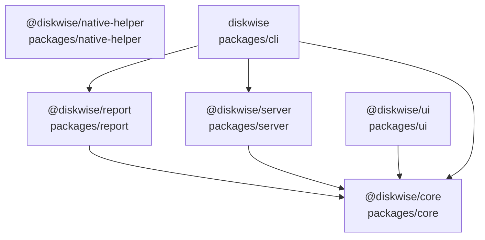

<!-- Generated by .github/scripts/generate-package-graph.mjs — do not edit by hand.
     Regenerated on pushes to main and PRs touching packages/** (see docs/graphify.md). -->

# Package dependency graph

Built from the `pnpm-workspace.yaml` manifests and the static imports under
`packages/*/src`. Solid arrows are declared workspace dependencies; dotted arrows
are imports found in source without a matching manifest entry. See
[graphify.md](./graphify.md) for how this file is produced.

| Package | Path | Declared workspace dependencies |
| --- | --- | --- |
| `@diskwise/core` | `packages/core` | — |
| `@diskwise/native-helper` | `packages/native-helper` | — |
| `@diskwise/report` | `packages/report` | `@diskwise/core` |
| `@diskwise/server` | `packages/server` | `@diskwise/core` |
| `@diskwise/ui` | `packages/ui` | `@diskwise/core` |
| `diskwise` | `packages/cli` | `@diskwise/core`, `@diskwise/report`, `@diskwise/server` |
